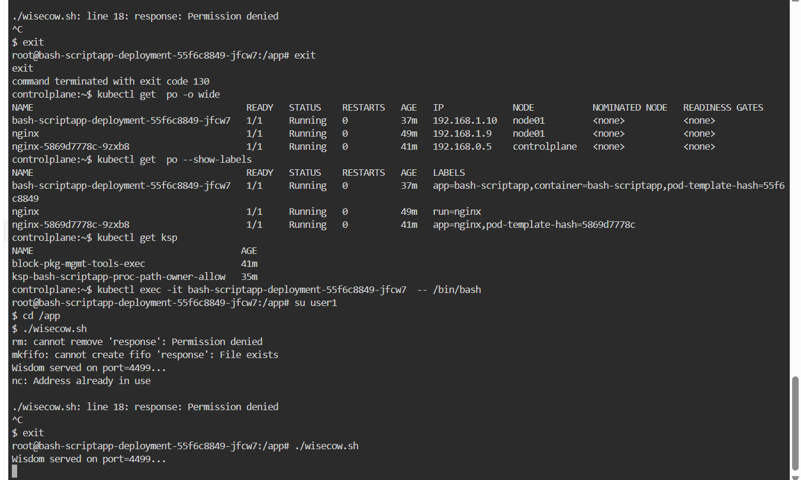

# Accuknox-DevOps-trainee Tasks

## Task - 01 ( Title: Containerisation and Deployment of Wisecow Application on Kubernetes )

## Task - 02
 [System Health Monitoring Script](scripts/system-utillisation-alert-script.sh),
 [Log File Analyzer](scripts/httpdnginx-metrics.sh)

## Task - 03 (A zero-trust KubeArmor policy for the Kubernetes workload )

### KubeArmor Policy: `ksp-bash-scriptapp-proc-path-owner-allow`

This policy enforces **owner-only execution** of the script `/app/wisecow.sh` and grants access only to required system binaries and configuration files for controlled root → user1 operations.

---

 1. Metadata & Selector

```yaml
apiVersion: security.kubearmor.com/v1
kind: KubeArmorPolicy
metadata:
  name: ksp-bash-scriptapp-proc-path-owner-allow
spec:
  severity: 7
  selector:
    matchLabels:
      container: bash-scriptapp
Explanation:

severity: 7 → High-priority policy violation.

selector → Applies only to containers labeled container: bash-scriptapp.

2. Process Rules
yaml
Copy code
process:
  matchPaths:
    - path: /app/wisecow.sh
      ownerOnly: true
  matchDirectories:
    - dir: /bin/
      recursive: true
    - dir: /usr/bin/
      recursive: true
Explanation:

Only the owner can execute /app/wisecow.sh.

/bin/ and /usr/bin/ allow execution of essential system binaries needed for user switching and other commands.

3. File Rules
yaml
Copy code
file:
  matchPaths:
    - path: /root/.bashrc
    - path: /root/.bash_history
    - path: /home/user1/.profile
    - path: /home/user1/.bashrc
    - path: /run/utmp
    - path: /dev/tty
  matchDirectories:
    - dir: /etc/
      recursive: true
    - dir: /proc/
      recursive: true
Explanation:

Grants access to shell configuration and history for root and user1.

Allows access to system directories /etc/ and /proc/ needed for user switching and session management.

4. Action
yaml
Copy code
action: Allow
Explanation:

Explicitly allows the listed processes and file accesses.

Any unlisted actions are denied by default if other restrictive policies exists

kubectl exec -it bash-scriptapp-... -- /bin/bash
su user1
cd /app
./wisecow.sh
After switching to user1, the script fails to remove/create the response file:

bash
Copy code
rm: cannot remove 'response': Permission denied
mkfifo: cannot create fifo 'response': File exists
This confirms file access restrictions: the policy allows execution, but file operations are restricted if the user doesn’t own the file.

5. Why it works sometimes
bash
Copy code
./wisecow.sh
Wisdom served on port=4499...
When run in some cases, the script succeeds in starting the service.

Likely because the port 4499 was free and the script didn’t need to overwrite response.

Previous errors (Address already in use) indicate the service is already running, or the FIFO file already exists.

✅ Summary of Findings
The Permission denied on line 18 is caused by file ownership restrictions enforced by KubeArmor.
Switching from root to user1 doesn’t fully bypass the restriction if the file response already exists or is owned by root.
The KubeArmor policy is correctly enforcing owner-only execution and limiting file operations.
```

